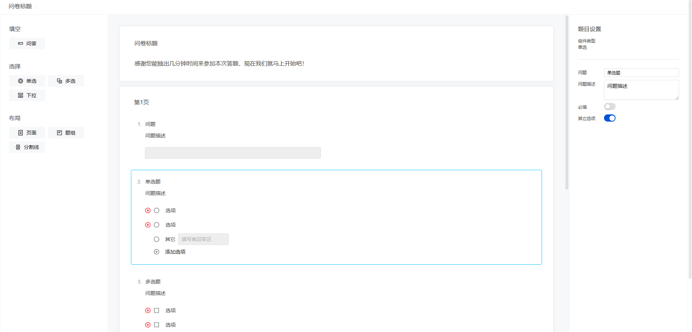

# Free Survey Form Builder

Free Survey Form Builder 是一个 Free Survey Core 的问卷设计器 Vue3 实现，提供了可视化的问卷设计界面，采用了插件化的设计，能够轻松扩展题型、自行实现题型界面。


 


## 界面



## 安装

```shell
npm install free-survey-form-builder
```

## 用法

main.ts ：

```typescript
import { createApp } from 'vue';
import App from './App.vue';

import FreeSurveyFormBuilder from 'free-survey-form-builder';
import 'free-survey-form-builder/style';

const app = createApp(App);
app.use(FreeSurveyFormBuilder);
app.mount('#app');
```

App.vue ：

```vue
<template>
  <div style="height: 100vh">
    <free-survey-form-builder v-model:survey="survey"></free-survey-form-builder>
  </div>
</template>

<script lang="ts" setup>
import { ref } from 'vue';
import { Survey } from 'free-survey-core';

const survey = ref(new Survey());
</script>
```

## 支持题型及元素

|         题型         | 是否支持 | 是否规划 |
| :------------------: | :------: | :------: |
|      页面(Page)      |    ✅    |          |
| 题组(QuestionGroup)  |    ✅    |          |
| 单项选择(RadioGroup) |    ✅    |          |
|  多项选择(CheckBox)  |    ❌    |    ✅    |
| 文本问答(SingleText) |    ✅    |          |
|  下拉选择(Dropdown)  |    ✅    |          |
|    时间选择(Time)    |    ❌    |    ✅    |
|   分割线(Splitter)   |    ❌    |    ✅    |
|      文件(File)      |    ❌    |    ✅    |

## 参与开发

Free Survey Form Builder 基于 Vue3 开发，界面部分采用了 [Tdesign](https://github.com/Tencent/tdesign-vue-next) ，并进行了部分样式修改。代码使用 prettier 和 TypeScript 进行格式和类型控制。

如果要参与开发，请将代码 fork 一份，并将 fork 的代码库克隆至本地，接着：

安装 npm 包

```sh
npm install
```

调试运行：

```sh
npm run dev
```

类型检查及发布：

```sh
npm run build
```

使用 [Vitest](https://vitest.dev/) 进行测试：

```sh
npm run test:unit
```

代码质量检查（采用 [ESLint](https://eslint.org/) ）：

```sh
npm run lint
```

### 添加题型

在 `packages/free-survey-form-builder/src/elements` 中存放着已有题型的代码，可参考这些实现。具体来说，需要实现至少四项内容：

1. 题型信息（AddableQuestion） ：提供题型的相关信息如名称、图标、类别、类名等，其中问题类题型的类名必须包含`page-element`和`question`，这是为了完成拖拽功能所添加的，实际上没有任何样式。页面元素则必须要添加`page-element`类名，理由同上。
2. 编辑区组件（UIElement）：这是在编辑区中呈现题目或元素的组件，每个添加到问卷中的组件（问题或元素）都会使用这个组件呈现在编辑区中，该组件会以 Prop 形式被自动注入当前问题的数据对象，Prop 的数据类型为`ElementProps`，为了完成数据的更新，还需要实现 Emit，具体的数据类型为`ElementEmits`。若要添加包含拖拽按钮和删除按钮等操作的操作栏，需要使用`element-with-operations-bar`组件包裹内容，它会自动添加操作栏并在鼠标悬停在题目上时显示，此外，还会显示一个边框。
3. 设置区组件（UIElement）：该组件是在界面右侧的题目设置区呈现的，当点击编辑区中的某个组件（问题或元素）时，右侧的题目设置区会显示该组件的相关信息和可用的设置，可用的设置就是由设置区组件呈现的。和编辑区组件一样，它会被自动以 Prop 形式注入当前组件的数据对象`SettingElementProps`，并接收`SettingElementEmits`类型的 Emit 以更新数据。
4. 问卷元素数据对象生成器（DataObjectGenerator）：此生成器是一个函数，主要作用是自定义插入时的数据对象，例如插入新问题时的题目默认名称等。

## 自行扩展题型

如果要自行扩展题型而不是添加到此库中，则新题型的开发与上方一致，但是目前暂时还为对外提供题型注册的接口，请等待后续开发。

## 反馈建议

请在 Free Survey Form Builder 的 [Github 仓库](https://github.com/HHaoWang/free-survey-form-builder) 提起 issue 以便进行反馈和建议。如有使用问题也可提出 issue。

## 项目未来规划

Free Survey Form Builder 目前仍处于非常早期的版本，主要专注于基础实现，因此对于一些基础功能以外的建设目前暂不考虑，例如国际化、文档补充、测试等。如果你对这些有兴趣，欢迎你参与建设。

## 交流与沟通

如果你有沟通和交流的意愿，欢迎你发送邮件至 <work@hhao.wang>。

## 开源协议

[Apache 2.0](LICENSE) &copy; HHao
